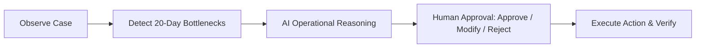

# 🛡️ Referral Guardian

> **AI-Powered Special Education Referral Continuity & Statutory IDEA Compliance Agent**  
> *Built by Team **Meridian*** 🚀

[](https://fastapi.tiangolo.com)
[](https://langchain-ai.github.io/langgraph/)
[](https://nextjs.org)
[](https://supabase.com)
[](https://opensource.org/licenses/MIT)

---

## 👥 Team **Meridian**

* **Celeste / Kriztal** ([@callmekriztal](https://github.com/callmekriztal)) — Lead Developer & Architecture
* **Aryan Nair** ([@ari2387q](https://github.com/ari2387q)) — AI Agent Engineering & Core Contributor
* **Arun Mathews** ([@arun-mathews](https://github.com/arun-mathews)) — Full-Stack Development & Core Contributor

---

## 🚨 The Problem

* **The 20-Day Statutory Deadline**: Under federal & state **IDEA** laws, school districts have **20 days** to evaluate a referred student and hold an IEP meeting.
* **Silent Stalls**: When an external doctor fails to respond or consent forms go missing, referrals stall quietly without alerts.
* **High Stakes**: Delays cost children months of critical therapy and expose school districts to state sanctions and **$20k–$100k+ legal lawsuits**.
* **Today's Reality**: Coordinators manually manage chaotic spreadsheets and react only *after* deadlines have already been missed.

---

## 💡 The Solution

**Referral Guardian** is an active AI agent that monitors referral timelines, flags bottlenecks before deadlines expire, and coordinates human-approved unblocking actions.



---

## ✨ Key Features

1. **⏱️ Deterministic Statutory Sentry**: 100% deterministic rules (no hallucinations) to catch `APPOINTMENT_DELAYED` at Day 20+, missing documents, or specialist non-responses.
2. **🤖 Human-in-the-Loop (HITL)**: LangGraph `interrupt()` pauses before execution. The coordinator has full control to **Approve**, **Modify**, or **Reject** recommendations.
3. **🩺 Specialist Portal (`/educator`)**: Clinicians log diagnostic notes directly, which **automatically resets the 20-day timer to Day 0** and clears bottlenecks.
4. **⚡ 20-Day Time-Warp Simulator**: Test case aging live using `+5d`, `+15d`, `+21d (Overdue)`, and `Reset` buttons.
5. **📜 Immutable Audit Trail**: Every event, recommendation, and approval is logged to SQLite and Supabase for compliance audits.

---

## 🛠️ Tech Stack

* **Frontend**: Next.js 16 (App Router), TypeScript, Tailwind CSS, Lucide React
* **Backend**: FastAPI, Python 3.11+, Pydantic v2
* **Agent Engine**: LangGraph, LangChain (OpenRouter / OpenAI / Mock Fallback)
* **Database**: SQLite (Local) with Supabase PostgreSQL sync

---

## 🚀 Quick Start

### 1. Backend
```bash
cd backend
python3 -m venv venv && source venv/bin/activate
pip install -e .
cp .env.example .env   # Optional: add API keys
uvicorn app.main:app --port 8000 --reload
```
API runs at `http://localhost:8000` (Docs: `http://localhost:8000/docs`).

### 2. Frontend
```bash
cd frontend
npm install
npm run dev
```
Dashboard runs at `http://localhost:3000`.

---

## 🎯 Quick Demo Walkthrough

1. **Create Referral**: In dashboard (`:3000`), click **New Referral Case** (e.g. `stu-rit-5001`).
2. **Simulate 20-Day Breach**: Click **`+21 Days (Overdue)`** in the case header. Status flags `APPOINTMENT_DELAYED`.
3. **Run AI Agent**: Click **Run Referral Guardian AI** $\rightarrow$ Agent suggests `CONTACT_SPECIALIST`.
4. **Approve Action**: Click **Approve Action** $\rightarrow$ Agent logs verified outreach.
5. **Doctor Submits Findings**: Open `/educator` portal, submit diagnostic notes $\rightarrow$ Case status becomes **ACTIVE** and statutory timer **resets back to Day 0**.

---

## 📜 License

MIT License. Built by Team **Meridian**.
