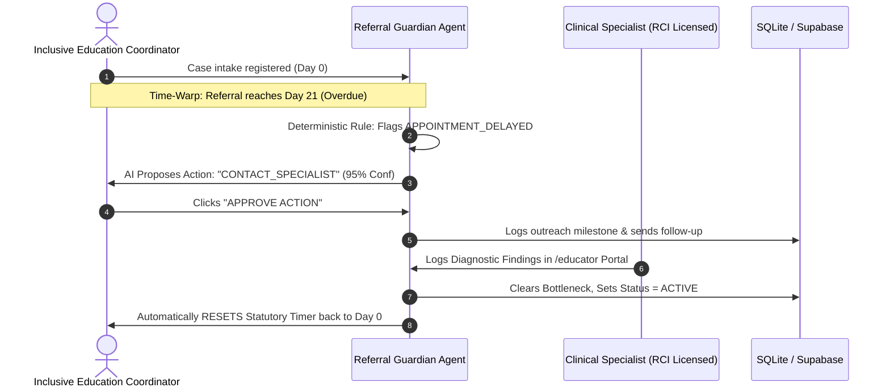
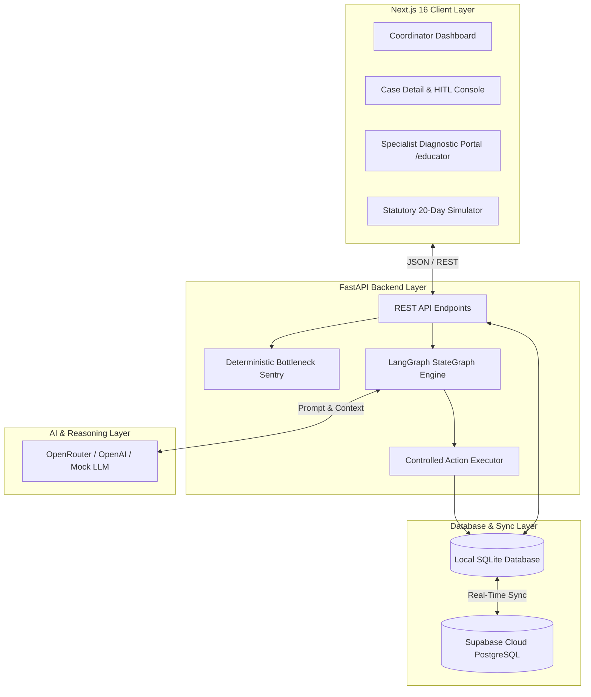
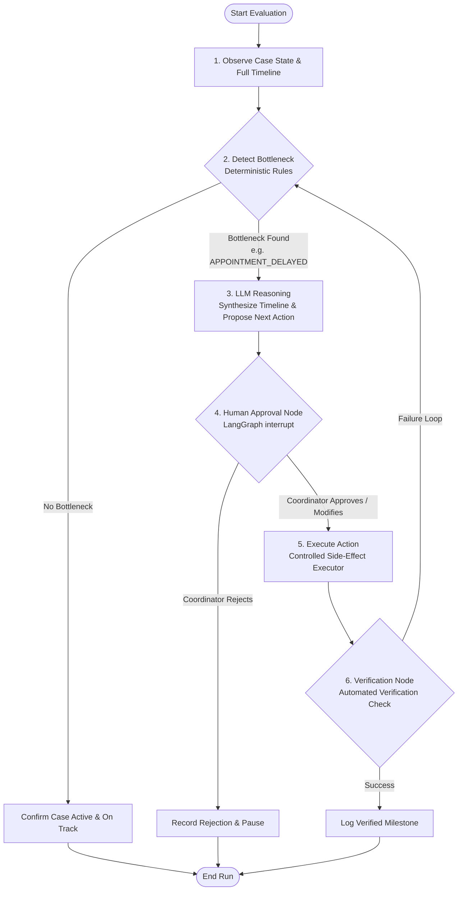

# 🛡️ Referral Guardian

> **AI-Powered Inclusive Education Referral Continuity & Statutory Assessment Compliance Platform (India)**  
> *Built with ❤️ by Team **Meridian***

[](https://fastapi.tiangolo.com)
[](https://langchain-ai.github.io/langgraph/)
[-black.svg?logo=next.js&logoColor=white)](https://nextjs.org)
[](https://supabase.com)
[](https://tailwindcss.com)
[](https://opensource.org/licenses/MIT)

---

## 👥 Built by Team **Meridian**

| Contributor | GitHub Profile | Role & Focus |
| :--- | :--- | :--- |
| **Christy Dominic Cyril** | [@callmekriztal](https://github.com/callmekriztal) | Lead System Architect & LangGraph Implementation |
| **Aryan Nair** | [@ari2387q](https://github.com/ari2387q) | Backend , AI Agent Reasoning & Testing |
| **Arun Mathews** | [@arun-mathews](https://github.com/arun-mathews) | Full-Stack UI/UX, Next.js Development |

---

## 📖 Table of Contents
1. [Overview & The Core Challenge in India](#-overview--the-core-challenge-in-india)
2. [Indian Regulatory Framework: RPwD Act 2016 & NEP 2020](#-indian-regulatory-framework-rpwd-act-2016--nep-2020)
3. [The 20-Day Statutory Assessment Timeline](#-the-20-day-statutory-assessment-timeline)
4. [How Referral Guardian Solves It](#-how-referral-guardian-solves-it)
5. [System Architecture & Data Flow](#-system-architecture--data-flow)
6. [The LangGraph Agentic Lifecycle](#-the-langgraph-agentic-lifecycle)
7. [Key Features & Platform Modules](#-key-features--platform-modules)
8. [Getting Started (Local Installation)](#-getting-started-local-installation)
9. [Interactive Demo Walkthrough Guide](#-interactive-demo-walkthrough-guide)
10. [REST API Documentation](#-rest-api-documentation)
11. [License](#-license)

---

## 🌟 Overview & The Core Challenge in India

In schools across India (CBSE, ICSE, and State Boards), when a teacher, parent, or counselor identifies a child experiencing learning difficulties, speech delays, autism spectrum traits, or behavioral challenges, they initiate an **Inclusive Education / Special Needs Referral**.

**Special Educators, Resource Teachers, and Inclusive Education Coordinators** in Indian schools must coordinate clinical evaluations across multiple stakeholders:
* Rehabilitation Council of India (**RCI**)-certified Clinical Psychologists
* Speech-Language Pathologists & Audiologists
* Occupational Therapists
* Pediatric Neurologists & District Early Intervention Centres (**DEICs** / **CRCs**)

### ⚠️ The Problem: Silent Referral Drop-Offs
Referrals involve multiple fragmented handoffs: parental consent, clinical screening, developmental history, and diagnostic testing. If an external therapist is unavailable, an assessment report is delayed, or a consent form is missing:
* **The referral silently stalls** with zero tracking.
* **The child loses months** of early intervention, individualized curriculum accommodations, and board examination dispensations (e.g., CBSE scribe/extra time concessions).
* **Schools risk non-compliance** with state education directives and disability rights mandates.

### 📋 Today's Reality in Indian Schools
Coordinators manually track cases on spreadsheets and paper registers, reacting only *after* severe delays have already occurred.

---

## ⚖️ Indian Regulatory Framework: RPwD Act 2016 & NEP 2020

* **Rights of Persons with Disabilities (RPwD) Act, 2016 (Chapter III — Education)**: Mandates that all educational institutions funded or recognized by the government provide inclusive education to children with disabilities without discrimination, ensuring early identification, specialized support, and reasonable accommodation across **21 specified disabilities**.
* **National Education Policy (NEP) 2020**: Emphasizes Equitable and Inclusive Education (Section 6), requiring schools to establish early childhood screening, resource centers, and individualized educational support plans.
* **Right to Education (RTE) Act, 2009**: Guarantees the fundamental right to free and compulsory education for all children with special needs in inclusive mainstream environments.

---

## ⏱️ The 20-Day Statutory Assessment Timeline

Under inclusive education administrative directives (e.g., Samagra Shiksha Inclusive Education Framework, CBSE Inclusive Education Guidelines), schools follow a mandatory **20-day assessment & determination timeline** upon referral intake:

1. **Days 1–5 (Intake & Screening)**: Document developmental history, review classroom screening data, and obtain written parental consent.
2. **Days 6–15 (Clinical Coordination)**: Connect with assigned RCI-licensed specialists (Speech Therapists, Psychologists, OTs) and complete diagnostic testing.
3. **Days 16–20 (Determination & IEP Plan)**: Finalize the diagnostic evaluation, convene the case conference with parents, and formulate the child's **Individualized Education Plan (IEP)** or Support Plan.

If 20 days pass without diagnostic completion, the case is flagged as **statutory overdue (`APPOINTMENT_DELAYED`)**.

---

## 💡 How Referral Guardian Solves It

**Referral Guardian** is an active, closed-loop AI continuity platform that monitors referrals in real time, catches bottlenecks before statutory deadlines pass, and coordinates human-approved unblocking actions.



---

## 🏗️ System Architecture & Data Flow

Referral Guardian separates **deterministic statutory rules** from **LLM operational reasoning** to ensure reliability and full compliance.



---

## The LangGraph Agentic Lifecycle

The core intelligence of Referral Guardian is implemented as a cyclic state graph using **LangGraph**:



### **The 6 Graph Nodes Explained:**
1. **`Observe`**: Fetches structured student referral attributes, specialist availability, and chronological milestones.
2. **`Detect Bottleneck`**: Executes 100% deterministic rules (no hallucinations) to flag overdue timelines (`APPOINTMENT_DELAYED` at Day 20+), missing documents, specialist unresponsiveness, or repeated failures ($\ge 3$ attempts).
3. **`Reason`**: Invokes the LLM to analyze the timeline and choose the single best operational action from a safe whitelist (`ALLOWED_ACTIONS`) with clear reasoning and evidence.
4. **`Human Approval (Interrupt)`**: Uses LangGraph `interrupt()` to freeze execution. The school coordinator can **Approve**, **Modify** (override the action), or **Reject**.
5. **`Execute`**: Runs the approved action via a dedicated controlled executor (e.g. contacting specialists, scheduling follow-ups, requesting documents).
6. **`Verify`**: Verifies that the side-effect succeeded and logs an immutable milestone to the case timeline.

---

## ✨ Key Features & Platform Modules

### 1. ⏱️ Deterministic Statutory Compliance Sentry
* **100% Deterministic**: Calculates days open and flags statutory assessment breaches with precision.
* **Bottleneck Taxonomy**:
  * `APPOINTMENT_DELAYED`: Case age $\ge 20$ days without completed assessment.
  * `NO_SPECIALIST_RESPONSE`: Specialist contacted but no assessment notes received.
  * `SPECIALIST_UNAVAILABLE`: Assigned specialist is on leave or fully booked.
  * `MISSING_DOCUMENT`: Mandatory parent consent or screening records pending.
  * `REPEATED_FAILURE`: 3 or more failed outreach attempts (escalates to School Management / Principal).

### 2. 🤖 Human-in-the-Loop (HITL) Safety Controls
* **No Unsupervised AI**: Special education decisions require professional human oversight. The agent cannot alter student records or reassign clinicians without coordinator approval.
* **Interactive Controls**: Coordinators can:
  * **Approve**: Execute the AI-recommended action in one click.
  * **Modify**: Select a replacement action from the dropdown with custom notes.
  * **Reject**: Dismiss the recommendation if resolved offline.

### 3. 🩺 Special Educator & Specialist Portal (`/educator`)
* **Dedicated Specialist View**: Therapists and psychologists log in, review assigned referrals, and toggle clinical availability (`AVAILABLE` / `UNAVAILABLE`).
* **Diagnostic Submission**: Specialists submit assessment findings directly into the student's case record.
* **Auto-Reset Recovery**: Submitting diagnostic findings **automatically clears bottlenecks, sets status to `ACTIVE`, and resets the 20-day timer back to Day 0**.

### 4. ⚡ Statutory 20-Day Timeline Simulator (Time-Warp Engine)
An interactive simulator embedded in the case header for live testing and demonstration:
* **`+5 Days`**: Advances referral timeline to Day 5 (Normal progress).
* **`+15 Days`**: Advances referral timeline to Day 15 (Amber warning).
* **`+21 Days (Overdue)`**: Advances referral past the 20-day limit, immediately triggering statutory breach detection (`APPOINTMENT_DELAYED`).
* **`Reset to Day 0`**: Restores the case timeline back to intake date.

---

## 🚀 Getting Started (Local Installation)

### Prerequisites
* **Python 3.11+**
* **Node.js 18+** and **npm**
* Git

---

### Step 1: Clone the Repository
```bash
git clone https://github.com/callmekriztal/Referal_Guardian.git
cd Referal_Guardian
```

---

### Step 2: Backend Setup (FastAPI + LangGraph)
```bash
# Navigate to backend directory
cd backend

# Create and activate a Python virtual environment
python3 -m venv venv
source venv/bin/activate    # On Windows use: venv\Scripts\activate

# Install Python dependencies
pip install -e .

# Configure environment variables
cp .env.example .env
# Optional: Add your OPENROUTER_API_KEY, OPENAI_API_KEY, or SUPABASE keys to .env
# If no keys are provided, the system seamlessly uses the built-in mock LLM engine!

# Launch FastAPI backend server
uvicorn app.main:app --host 0.0.0.0 --port 8000 --reload
```
* Backend API will be running at: **`http://localhost:8000`**
* Interactive Swagger Docs available at: **`http://localhost:8000/docs`**

---

### Step 3: Frontend Setup (Next.js 16)
```bash
# Open a new terminal and navigate to frontend directory
cd frontend

# Install Node dependencies
npm install

# Start Next.js development server
npm run dev
```
* Web application will be running at: **`http://localhost:3000`**

---

## 🎯 Interactive Demo Walkthrough Guide

Follow these steps for a complete live demonstration:

1. **Intake New Referral**:
   * Open `http://localhost:3000` and click **"New Referral Case"**.
   * Create a student (e.g. `stu-rit-5001`) with referral type *Speech-Language Evaluation*.
2. **Simulate 20-Day Statutory Breach**:
   * Open the newly created case detail page.
   * In the **Statutory 20-Day Assessment Timeline Simulator**, click **`+21 Days (Overdue)`**.
   * Notice the progress bar turns red and the case is flagged **STUCK** with bottleneck `APPOINTMENT_DELAYED`.
3. **Run AI Agent Evaluation**:
   * Click **"Run Referral Guardian AI"**.
   * LangGraph analyzes the case and pauses at the approval node, recommending **`CONTACT_SPECIALIST`** with 95% confidence.
4. **Approve Action**:
   * Click **"APPROVE ACTION"**. The agent executes the specialist follow-up and logs a verified event to the timeline.
5. **Specialist Submits Diagnostic Notes**:
   * Navigate to the **Specialist Portal** at `http://localhost:3000/educator`.
   * Locate `stu-rit-5001` and submit clinical diagnostic findings (e.g., *"Completed speech screening. Moderate articulation delay noted."*).
6. **Observe Automatic Closed-Loop Recovery**:
   * Return to the case detail page.
   * The bottleneck is resolved, status is restored to **`ACTIVE`**, and the 20-day statutory countdown timer **automatically resets back to Day 0**!

---

## 📡 REST API Documentation

| Method | Endpoint | Description |
| :--- | :--- | :--- |
| `GET` | `/api/dashboard` | Returns live KPI counts (Active, Stuck, Pending Approvals, Escalations) |
| `GET` | `/api/cases` | Lists all the referral cases with age and bottleneck status |
| `POST` | `/api/cases` | Creates a new referral case |
| `GET` | `/api/cases/{id}` | Returns case details and full chronological timeline |
| `POST` | `/api/cases/{id}/fast-forward` | **Time-Warp Engine**: Sets case age (`{ "days": 21 }`) |
| `POST` | `/api/cases/{id}/agent/run` | Triggers LangGraph agent evaluation and pauses for HITL approval |
| `POST` | `/api/cases/{id}/agent/approve` | Approves recommendation and resumes graph execution |
| `POST` | `/api/cases/{id}/agent/modify` | Overrides recommended action with coordinator's choice |
| `POST` | `/api/cases/{id}/agent/reject` | Rejects recommendation and terminates current run |
| `POST` | `/api/cases/{id}/diagnostics` | Specialist endpoint: logs evaluation notes and auto-resets timeline |
| `GET` | `/api/specialists` | Lists specialists with live availability and opening dates |

---

## 📜 License

This project is licensed under the **MIT License** — see the [LICENSE](LICENSE) file for details.

---

<div align="center">
  <sub>Built with ❤️ by Team <b>Meridian</b> for seamless Inclusive Education continuity in India.</sub>
</div>
